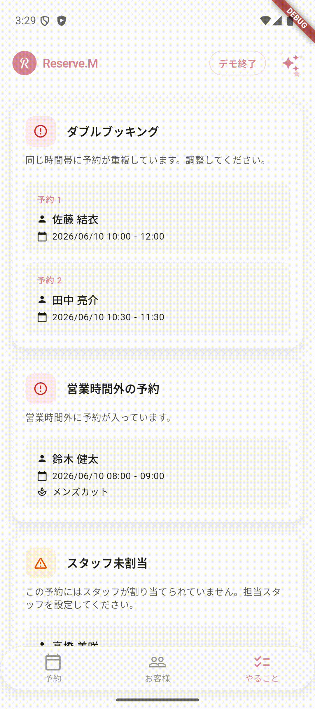

# Android ViewModel Migration Lab

AI-guided OSS lab for safely migrating legacy Android AAC/ViewModel shared-state samples to Kotlin, Compose, ViewModel, and StateFlow.

This repository turns a 2017 Android AAC/ViewModel practice project into a documented, tested, AI-guided OSS migration lab where humans and AI coding agents can modernize legacy shared-state code through small, reviewable, guideline-driven pull requests.

## Motivation

Many Android apps still depend on older architecture patterns such as early Android Architecture Components, shared state between screens, and mixed legacy APIs.

Small migration changes in those apps are risky, especially when multiple screens must stay synchronized. This repository turns a 2017 Android AAC/ViewModel practice sample into a documented, tested migration lab that can be followed safely.

The goal is to provide a clear path where humans and AI coding agents can modernize legacy code in small, reviewable steps.

This project started as `Android-AAC-ViewModel-Practice`, and the identity is now aligned to the migration-lab purpose.

## What this project is

- a legacy Android architecture migration lab
- a small runnable Kotlin + Compose sample
- a ViewModel + StateFlow shared-state example
- a documentation-first OSS project
- a reference workflow for AI-assisted migration pull requests

## What this project is not

- a production app
- a full Android architecture framework
- a business-domain sample
- a Reserve.M project
- a Hilt / Room / Firebase / Navigation showcase

## Core scenario

```text
Article List
↓
Article Detail
↓
Edit Article
↓
Save
↓
Back to List
↓
Updated Article is reflected
```

## Current modern solution

The modern version provides:

- Kotlin + Compose UI
- ViewModel
- StateFlow
- Reducer-style state updates

## What this project will teach

- How to keep shared state synchronized across multiple screens
- How to migrate legacy Android Architecture Components patterns to modern Kotlin/Compose architecture
- How to structure reducer and ViewModel tests

## Current status

Completed in this phase:

- Project direction clarified as `Android ViewModel Migration Lab`
- Legacy README preserved as historical documentation
- OSS metadata files added (`LICENSE`, `CONTRIBUTING.md`, `SECURITY.md`, `CODE_OF_CONDUCT.md`, `CHANGELOG.md`)
- GitHub issue/PR templates added
- Modern Kotlin/Compose baseline created
- Article domain model, reducer, ViewModel, and tests added
- Compose list/detail screens implemented
- Android CI workflow added
- Release workflow added for `v0.1.0-oss-alpha.1` tag push
- `v0.1.0-oss-alpha.1` first OSS alpha release is published
  - GitHub Release: `v0.1.0-oss-alpha.1`
  - Sample debug APK: `app-debug.apk`

## AI-guided migration workflow

This repository is designed so both humans and AI coding agents can follow the same process.

1. Read `docs/oss-remake-task-plan.md`
2. Pick one migration task
3. Create a small pull request
4. Add/adjust tests for behavior changes
5. Update documentation together with behavior changes
6. Run `./gradlew test`
7. Run `./gradlew assembleDebug`
8. Merge only when scope is clear and CI is green

The preferred approach is small, incremental migration.

## Requirements

- Android Studio
- JDK 17
- Android SDK
- Git

If you use Android Studio, the bundled JBR is usually enough.

## Quick start

1. Clone the repository
   ```bash
   git clone https://github.com/leesunghyun/android-viewmodel-migration-lab.git
   cd android-viewmodel-migration-lab
   ```

2. Run tests

macOS / Linux:
   ```bash
   ./gradlew test
   ./gradlew assembleDebug
   ```

Windows:
   ```bat
   gradlew.bat test
   gradlew.bat assembleDebug
   ```

3. Open in Android Studio and run the `app` module.

## Demo

The first alpha flow is: `List → Detail/Edit → Save → List` with shared state update.



Manual smoke check:

1. Open the app and confirm the article list screen appears.
2. Tap an article, open detail/edit, change title/body.
3. Tap **Save** and return to list.
4. Confirm the edited item is immediately updated in the list.

## Release status

- First OSS alpha release: [v0.1.0-oss-alpha.1](https://github.com/leesunghyun/android-viewmodel-migration-lab/releases/tag/v0.1.0-oss-alpha.1)
- APK is provided as a sample debug artifact for manual smoke testing (not production release).

For full release details and run verification commands, see:
- [Release Notes](docs/release-notes-v0.1.0-oss-alpha.1.md)
- [Release Guide](docs/release-guide-v0.1.0-oss-alpha.1.md)

## Project structure

```text
app/        Modern Kotlin + Compose sample app (built in this alpha)
legacy-app/ Original 2017 Android AAC sample (archive only, reference)
docs/       Migration documentation and release notes
```

Only `app/` is built in the first alpha.
`legacy-app/` is preserved for historical reference only.

## Migration docs

- [2017 Legacy Architecture](docs/01-legacy-architecture.md)
- [Modern Architecture](docs/02-modern-architecture.md)
- [Shared State Problem](docs/03-shared-state-problem.md)
- [LiveData to StateFlow](docs/04-livedata-to-stateflow.md)
- [Compose UI Guide](docs/05-compose-ui.md)
- [Release Notes: v0.1.0-oss-alpha.1](docs/release-notes-v0.1.0-oss-alpha.1.md)
- [Release Guide: v0.1.0-oss-alpha.1](docs/release-guide-v0.1.0-oss-alpha.1.md)
- [Roadmap: v0.2.0](docs/roadmap-v0.2.0.md)
- [Release Notes: v0.2.0-oss-alpha.1](docs/release-notes-v0.2.0-oss-alpha.1.md)
- [Migration Task Plan (source of truth)](docs/oss-remake-task-plan.md)
- [Codex for OSS](docs/codex-for-oss.md)

## Archive

- [Historical planning references](docs/planning/archive/oss-remake-plan-reference.md)

## Roadmap

- [x] Preserve legacy baseline as archive (`legacy-app/`)
- [x] Preserve legacy 2017 snapshot (`legacy/2017-original`, `v0.0.0-legacy-2017`)
- [x] Move original app code into `legacy-app/`
- [x] Add modern app baseline
- [x] Add Article domain/model and reducer
- [x] Add ArticleListReducer tests
- [x] Add ViewModel + StateFlow implementation
- [x] Add Compose screens
- [x] Add unit tests
- [x] Add Android CI workflow
- [x] Publish migration document bundle
- [x] Add release notes and changelog section for v0.1.0-oss-alpha.1

## Next milestones (planned, v0.2)

- [x] Replace demo placeholder with real screen recording (`docs/images/demo.gif`)
- [ ] Improve Article detail validation UX
- [ ] Add before/after diagram for v0.2 release docs
- [ ] Improve connected test coverage for back-without-save and invalid selection scenarios

## Recently completed after v0.1.0

- [x] Add `collectAsStateWithLifecycle` in Compose state collection
- [x] Add Compose UI smoke tests (`ArticleUiSmokeTest`)

## Repository settings

The GitHub repository identity has been updated to match the migration-lab purpose:

- Repository name: `android-viewmodel-migration-lab`
- Description: `AI-guided OSS lab for safely migrating legacy Android AAC/ViewModel shared-state samples to Kotlin, Compose, ViewModel, and StateFlow.`
- Topics: `android`, `kotlin`, `jetpack-compose`, `viewmodel`, `stateflow`, `legacy-code`, `migration-guide`, `ai-assisted-development`

## Contributing

Please read [`CONTRIBUTING.md`](CONTRIBUTING.md) and add small, focused changes.

## License

Apache-2.0. See [`LICENSE`](LICENSE).
